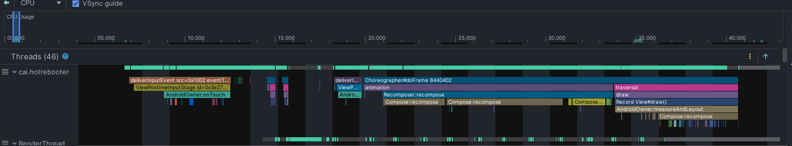
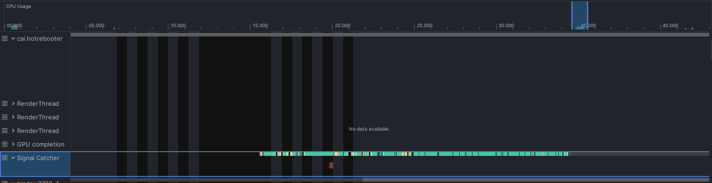
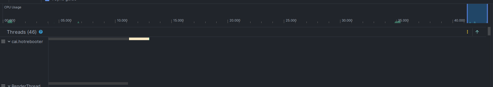

# Hot reboot test (Android app)
Reproducing a hot reboot trigger in a new project with the setup of another project where this originally happened
#### Note: The code is not meant to be clean, it is just a recreation of a scene which triggered hot reboot on android 13 

## Logcats
- [on Android 13](logcat33.md) (Galaxy Note 10 Lite)
- [on Android 10](logcat29.md) (Galaxy Note 9)

## Profiler screenshots (on Android 13)
- On click

- Something in the middle

- Before crashing (hot rebooting)

# Disclaimer
**This is not meant for usage, try it at your own risk. No warranty whatsoever.**